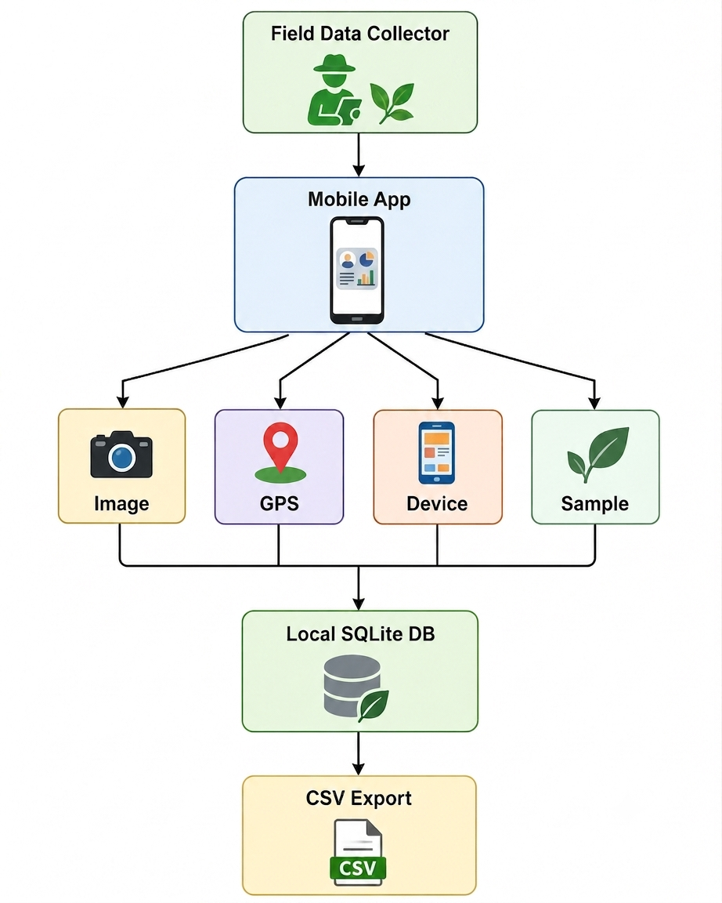
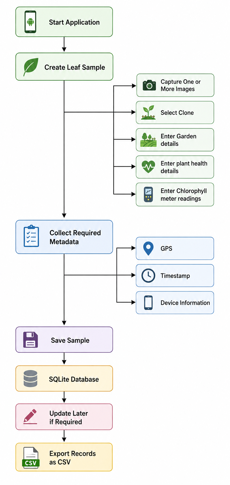
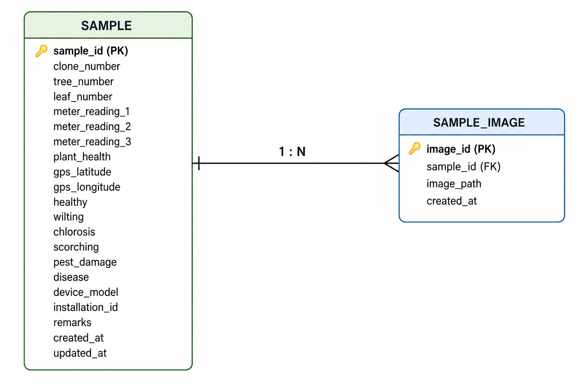

# Tea Leaf Data Collection System

A mobile application developed during an industrial internship to support the collection, organization, and synchronization of tea leaf image data and associated field information for a future machine learning-based chlorophyll concentration estimation system.

---

## Table of Contents

- [1. Project Overview](#1-project-overview)
- [2. Background](#2-background)
- [3. Customer Requirements](#3-customer-requirements)
- [4. Problem Statement](#4-problem-statement)
- [5. Proposed Solution](#5-proposed-solution)
- [6. System Workflow](#6-system-workflow)
- [7. Database Design](#7-database-design)
- [8. Features Delivered](#8-features-delivered)
- [9. Future Improvements](#9-future-improvements)
- [10. Technologies Used](#10-technologies-used)
- [11. Team Contributions](#11-team-contributions)

---

# 1. Project Overview

The **Tea Leaf Data Collection System** is an mobile application developed as part of an industrial internship to assist researchers and field data collectors in collecting structured tea leaf image data.

The long-term objective of the larger research project is to develop a machine learning model capable of estimating the chlorophyll concentration of a tea leaf directly from an image.

The primary focus of this internship is therefore not the machine learning model itself, but the development of a reliable system for collecting and organizing the data required for future machine learning work.

# 2. Background

Chlorophyll concentration is an important characteristic of tea leaves and can provide useful information for agricultural and research purposes.

Currently, there are two primary approaches for obtaining chlorophyll concentration measurements.

### i. Wet-Lab Method

The wet-lab method is considered the highly accurate reference method.

A portion of the tea leaf is processed in a laboratory, including immersion in acetone for a specified period, followed by laboratory measurement.

Advantages:
- High accuracy when performed correctly
- Suitable as a reference or "gold standard" measurement

Disadvantages:
- Time-consuming
- Expensive
- Requires laboratory facilities
- Requires careful adherence to the experimental procedure
- Measurements cannot be obtained immediately in the field

### ii. Chlorophyll Meter Method

The second method uses a specialized chlorophyll concentration meter.

The meter estimates chlorophyll concentration by passing different types of light through a portion of the leaf and analyzing the received light.

Advantages:
- Can be used directly in the field
- Measurement takes less than a minute

Disadvantages:
- Less accurate than the wet-lab method
- The instrument is expensive

# 3. Customer Requirements

The primary requirement was to provide a simple and reliable interface for collecting tea leaf data in the field.

Key Requirements:
- Maintain a simple interface suitable for field data collection.
- Capture tea leaf images using the smartphone camera.
- Work without continuous internet access.
- Record sample information such as:
   - Clone number
   - Garden name
   - Plant health
- Maintain unique identification number.
- Associate each image with its corresponding sample.
- Store important metadata such as GPS location and timestamp along with image information.
- Keep images and sample information synchronized to minimize manual mapping errors.
- Provide a way to export collected records as CSV.
- Use PNG images to preserve image quality for further analysis.

# 4. Problem Statement

Tea leaf quality assessment through chlorophyll content requires reliable measurement methods. Wet-lab testing involves transporting leaves to a laboratory, which is time-consuming and requires careful handling to maintain accuracy. Chlorophyll meters provide a faster alternative by using light to estimate chlorophyll content, but their high cost makes them difficult for many tea growers to afford.

Therefore, it is planned to develop a machine-learning model that can estimate the chlorophyll concentration of a tea leaf from its image and assess its quality. This could reduce the dependence on expensive equipment and time-consuming laboratory testing.

A **good-quality dataset is crucial for training the model**. The images must be correctly associated with their chlorophyll readings and relevant metadata to ensure a clean, consistent, and reliable dataset without incorrect or conflicting records.

# 5. Proposed Solution

The proposed solution is to develop a mobile application to collect tea leaf images along with necessary data such as chlorophyll meter readings, plant health, and sample metadata. The application is designed to keep each image correctly associated with its corresponding sample, helping create a clean, consistent, and conflict-free dataset for machine-learning training.

The overall concept is:

# 6. System Workflow

The general workflow is:

# 7. Database Design

The current implementation uses two main database tables:

# 8. Features Delivered

The following features have been implemented as part of the current internship phase.

### i. Core Application
   - Mobile application
   - Minimal field-oriented user interface
   - Sample creation
   - Sample updating
   - Local data storage
### ii. Sample Management
   - Tea leaf information
   - Unique sample identification
   - Multiple images per sample
### iii. Metadata Collection
   - GPS coordinates
   - Timestamp
   - Device model
   - Installation id
### iv. Image Management
   - Camera-based image capture
   - Image stored PNG format
   - Multiple images for one sample
### v. Data Export
   - CSV file generation
   - User-selected export location
   - Export of sample records
### vi. Offline Operation
   - Local database
   - Field data collection without continuous internet connectivity

# 9. Future Improvements

### i. Portable Label Printing
   - A Wi-Fi-enabled portable label printer could be integrated.
   - The printer could print the sample ID, which can be attached to the leaf's sample bag for easy identification and tracking.

### ii. Wet-Lab Data Entry Interface
   - A laboratory interface could allow the lab assistant to:
      - Scan or enter the sample ID.
      - Enter the corresponding wet-lab chlorophyll concentration.

### iii. Improved Synchronization
   - A centralized database could be introduced to store all collected sample data in one location.
   - Authorized users could access and view the sample data from different devices.
   - This would make it easier to synchronize field and laboratory data and maintain a common dataset.

### iv. Backup and Recovery
   Future versions could include:
   - Automatic local backups
   - Database backup/export
   - Recovery after application failure
   - Cloud synchronization

# 10. Technologies Used
- React Native
- Expo
- EAS (Expo Application Service)
- React Native Vision Camera
- React Native Nitro Image
- JavaScript / TypeScript

# 11. Team Contributions

The project was developed collaboratively as an internship team.

### Team Member	Responsibilities -

- **Priyam Nath**	: 
   - Database design
   - Camera integration
   - Image processing
- **Shristi Saha** : 
   - GPS integration
   - Device identification
   - UI components development
- **Ansuma Boro** : 
   - UI/UX development
   - Frontend development
   - CSV generation
   - Export service
